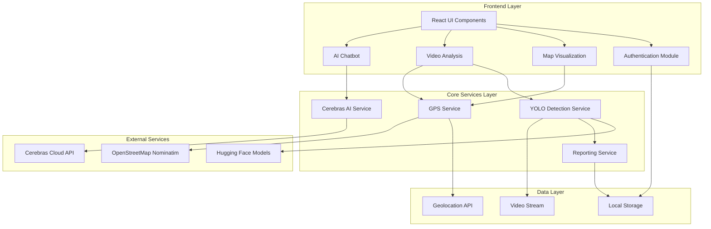
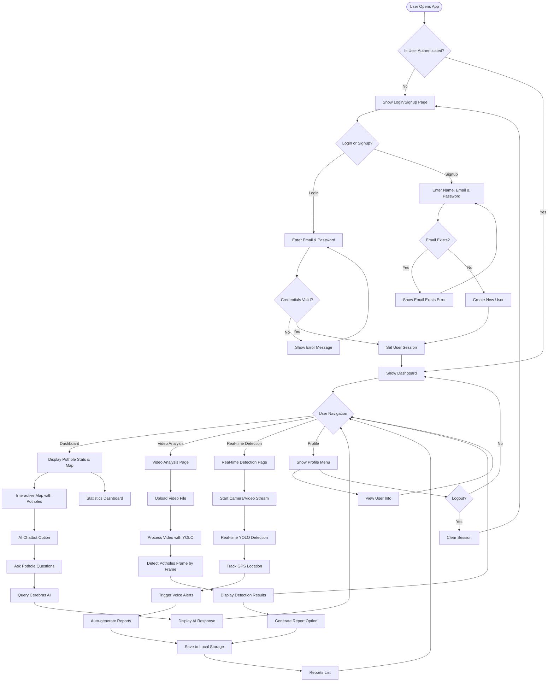

# ROADSENSE AI - Testing & Architecture Documentation

## 1. Context-Free Diagram (System Architecture)

## 2. Application Flowchart

## 3. Test Cases & Testing Tables

### 3.1 Unit Testing Test Cases

| Test ID | Component/Module | Test Case Description | Input | Expected Output | Status |
|---------|-----------------|----------------------|-------|----------------|--------|
| UT-001 | AuthContext | User signup with valid data | name: "John", email: "john@test.com", password: "pass123" | User created, returns true | To Test |
| UT-002 | AuthContext | User signup with existing email | email: "existing@test.com" | Returns false, error message | To Test |
| UT-003 | AuthContext | User login with valid credentials | email: "john@test.com", password: "pass123" | Returns true, user session set | To Test |
| UT-004 | AuthContext | User login with invalid credentials | email: "john@test.com", password: "wrong" | Returns false, error message | To Test |
| UT-005 | AuthContext | User logout | Authenticated user clicks logout | User session cleared, redirect to auth | To Test |
| UT-006 | GPSService | Get current position | Request GPS location | Returns coordinates object | To Test |
| UT-007 | GPSService | Calculate distance between two points | coord1, coord2 | Returns distance in meters | To Test |
| UT-008 | GPSService | Reverse geocode coordinates | lat: 12.9716, lng: 77.5946 | Returns address string | To Test |
| UT-009 | YOLODetectionService | Load YOLO model | Model name: 'Xenova/detr-resnet-50' | Model loaded successfully | To Test |
| UT-010 | YOLODetectionService | Detect potholes in image | Valid image element | Returns array of detections | To Test |
| UT-011 | YOLODetectionService | Detect with confidence threshold | image, threshold: 0.7 | Returns only detections > 0.7 | To Test |
| UT-012 | ReportingService | Create pothole report | Detection object, GPS data | Returns PotholeReport object | To Test |
| UT-013 | ReportingService | Save report to file | Valid report object | Returns true, report saved | To Test |
| UT-014 | ReportingService | Get report statistics | Multiple reports | Returns correct stats object | To Test |
| UT-015 | ReportingService | Filter reports by status | status: 'pending' | Returns only pending reports | To Test |
| UT-016 | CerebrasAI | Execute Python command | command: "print('hello')" | Returns output array | To Test |
| UT-017 | CerebrasAI | Get chatbot response | messages array | Returns AI response string | To Test |
| UT-018 | CerebrasAI | Stream chatbot response | messages, callbacks | Calls onChunk multiple times | To Test |
| UT-019 | ProtectedRoute | Access with authentication | Authenticated user | Renders children components | To Test |
| UT-020 | ProtectedRoute | Access without authentication | Unauthenticated user | Redirects to /auth | To Test |

### 3.2 Integration Testing Test Cases

| Test ID | Integration Scope | Test Case Description | Prerequisites | Expected Result | Status |
|---------|------------------|----------------------|---------------|----------------|--------|
| IT-001 | Auth + Protected Routes | Login and access dashboard | Valid user credentials | User redirected to dashboard | To Test |
| IT-002 | Auth + Protected Routes | Access protected route without login | No active session | User redirected to /auth | To Test |
| IT-003 | YOLO + GPS + Reporting | Complete detection workflow | Video file, GPS enabled | Detections with location saved | To Test |
| IT-004 | Video Analysis + YOLO | Upload and analyze video | Valid video file | All frames processed, results shown | To Test |
| IT-005 | Real-time Detection + GPS | Live detection with location | Camera access, GPS enabled | Real-time detections with GPS | To Test |
| IT-006 | Chatbot + Cerebras API | Ask question to AI | Valid API key | Receives and displays response | To Test |
| IT-007 | Reporting + Storage | Generate and retrieve report | Detection data | Report saved and retrievable | To Test |
| IT-008 | Map + GPS + Reports | Display reports on map | Multiple reports with GPS | All reports shown as markers | To Test |

### 3.3 Acceptance Testing Test Cases

| Test ID | Feature | User Story | Acceptance Criteria | Test Steps | Expected Result | Status |
|---------|---------|-----------|-------------------|-----------|----------------|--------|
| AT-001 | User Authentication | As a user, I want to create an account | 1. Signup form accessible 2. Validation works 3. Account created successfully | 1. Open app 2. Click signup 3. Enter name, email, password 4. Submit form | Account created, user logged in automatically | To Test |
| AT-002 | User Authentication | As a user, I want to login to my account | 1. Login form accessible 2. Credentials validated 3. Session maintained | 1. Open app 2. Enter email and password 3. Click login | User authenticated and redirected to dashboard | To Test |
| AT-003 | User Authentication | As a user, I want to logout | 1. Logout option visible 2. Session cleared on logout | 1. Click profile button 2. Click logout | Session cleared, redirected to login | To Test |
| AT-004 | Video Analysis | As a user, I want to upload and analyze a video | 1. Video upload works 2. Processing shows progress 3. Results displayed clearly | 1. Go to video analysis 2. Upload video file 3. Wait for processing | Potholes detected and displayed with timestamps | To Test |
| AT-005 | Real-time Detection | As a driver, I want real-time pothole alerts | 1. Camera access granted 2. Real-time detection works 3. Voice alerts trigger | 1. Go to real-time detection 2. Start camera 3. Drive with device | Potholes detected in real-time, alerts triggered | To Test |
| AT-006 | GPS Tracking | As a user, I want location data for detections | 1. GPS permission granted 2. Location captured accurately 3. Address resolved | 1. Enable GPS 2. Perform detection | Location and address shown in report | To Test |
| AT-007 | Reporting | As a user, I want to generate and save reports | 1. Report generation works 2. Reports saved to device 3. Reports viewable | 1. Complete detection 2. Generate report 3. View reports list | Report created with all details, downloadable | To Test |
| AT-008 | AI Chatbot | As a user, I want to ask questions about potholes | 1. Chatbot accessible 2. Responses relevant 3. Streaming works | 1. Open chatbot 2. Type question 3. Submit | AI provides relevant response about potholes | To Test |
| AT-009 | Dashboard | As a user, I want to see pothole statistics | 1. Stats display correctly 2. Data updates properly 3. Visualizations clear | 1. Login 2. View dashboard | Statistics shown with charts and numbers | To Test |
| AT-010 | Map View | As a user, I want to see potholes on a map | 1. Map loads properly 2. Markers display correctly 3. Interaction works | 1. View dashboard/map 2. Check pothole markers | All detected potholes shown as markers on map | To Test |

### 3.4 System Testing Scenarios

| Scenario ID | Scenario Name | Test Description | Steps | Expected Outcome | Status |
|-------------|--------------|------------------|-------|------------------|--------|
| ST-001 | Complete User Journey | End-to-end workflow from signup to detection | 1. Signup 2. Login 3. Upload video 4. Analyze 5. View results 6. Generate report | All features work seamlessly | To Test |
| ST-002 | Offline Detection | Video analysis without internet | 1. Disconnect internet 2. Upload video 3. Analyze | YOLO model works offline (if pre-loaded) | To Test |
| ST-003 | Multiple User Sessions | Multiple users using different accounts | 1. User A logs in 2. User B logs in different browser 3. Both perform detections | Data isolated per user account | To Test |
| ST-004 | Browser Compatibility | Test across different browsers | Test on Chrome, Firefox, Safari, Edge | Consistent functionality across browsers | To Test |
| ST-005 | Mobile Responsiveness | Test on mobile devices | Test on iOS and Android devices | Responsive design, touch interactions work | To Test |
| ST-006 | Performance Load | High-resolution video processing | Upload 4K/large video file | Processing completes without crashes | To Test |
| ST-007 | GPS Accuracy | Detection in various locations | Detect potholes in different areas | GPS coordinates accurate within 10m | To Test |
| ST-008 | Data Persistence | Reports persist across sessions | 1. Create reports 2. Logout 3. Login again | Reports still available after re-login | To Test |

### 3.5 Non-Functional Testing

| Test ID | Test Type | Test Case | Metric | Target | Status |
|---------|-----------|-----------|--------|--------|--------|
| NFT-001 | Performance | Video frame processing speed | FPS | ≥15 FPS for real-time | To Test |
| NFT-002 | Performance | Model loading time | Seconds | ≤5 seconds | To Test |
| NFT-003 | Performance | Dashboard load time | Seconds | ≤2 seconds | To Test |
| NFT-004 | Usability | Login form completion | Steps | ≤3 steps | To Test |
| NFT-005 | Usability | Detection result clarity | User comprehension | 90% understand results | To Test |
| NFT-006 | Security | Password storage | Method | Hashed (not plain text) | To Test |
| NFT-007 | Security | Session management | Timeout | Auto-logout after inactivity | To Test |
| NFT-008 | Compatibility | Browser support | Browsers | Chrome, Firefox, Safari, Edge | To Test |
| NFT-009 | Reliability | Detection accuracy | Accuracy | ≥85% pothole detection | To Test |
| NFT-010 | Reliability | GPS accuracy | Meters | Within 10m accuracy | To Test |

### 3.6 Test Execution Checklist

#### Pre-Test Setup
- [ ] Verify all dependencies installed
- [ ] Confirm Cerebras API key configured
- [ ] Check browser permissions (camera, GPS)
- [ ] Prepare test data (videos, images)
- [ ] Set up test user accounts

#### Test Execution
- [ ] Execute all unit tests
- [ ] Run integration tests
- [ ] Perform acceptance testing
- [ ] Conduct system testing
- [ ] Complete non-functional testing

#### Post-Test Activities
- [ ] Document all test results
- [ ] Log defects found
- [ ] Generate test report
- [ ] Update test cases based on findings
- [ ] Plan regression testing

### 3.7 Defect Tracking Template

| Defect ID | Test Case ID | Severity | Description | Steps to Reproduce | Expected | Actual | Status |
|-----------|-------------|----------|-------------|-------------------|----------|--------|--------|
| DEF-001 | | | | | | | |
| DEF-002 | | | | | | | |

**Severity Levels:**
- **Critical**: System crash, data loss, security breach
- **High**: Major feature not working, blocking functionality
- **Medium**: Feature works with workaround, minor impact
- **Low**: Cosmetic issues, minor UI problems

---

## Testing Notes

### Testing Environment Requirements
- Node.js version: ≥18.x
- Browsers: Chrome 90+, Firefox 88+, Safari 14+, Edge 90+
- Mobile: iOS 14+, Android 10+
- Internet connection for API calls
- Camera access for real-time detection
- GPS/Location services enabled

### Test Data Requirements
- Sample video files (various resolutions)
- Test user credentials
- Sample pothole images
- GPS coordinates for testing locations

### Automated Testing Recommendations
Consider implementing:
- Jest for unit testing
- React Testing Library for component testing
- Cypress or Playwright for E2E testing
- Jest coverage reports for code coverage tracking
